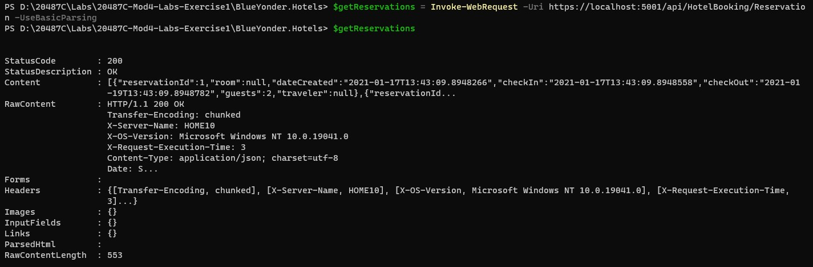
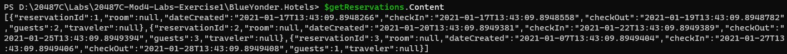
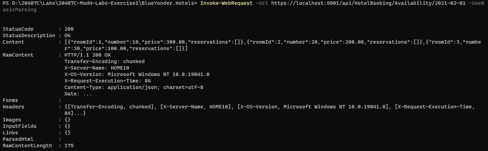
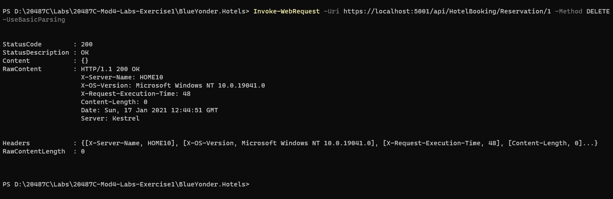
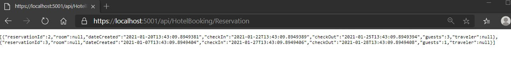
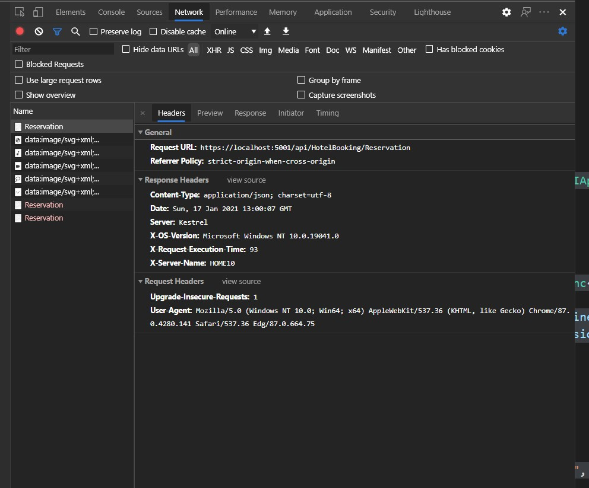

# Module 4: Extending ASP.NET Core HTTP Services

# Lab: Customizing the ASP.NET Core Pipeline

1. **Nombres y apellidos:** Francisco Javier Moreno Quevedo
2. **Fecha:** 17/01/2021
3. **Resumen del Ejercicio:**  Usar la inyeccion de dependecias,. Implementar un filtro de acción que almacene en caché el resultado del servicio. Implementar el middleware que devuelva el servicio.
4. **Dificultad o problemas presentados y como se resolvieron:** Ninguna


#### Exercise 1: Use Dependency Injection to Get a Repository Object

- Abrimos el proyecto **BlueYonder.Hotels** y lo restauramos

- Creamos el interface **IHotelBookingRepository** en **IHotelBookingRepository.cs**.

```cs
using BlueYonder.Hotels.DAL.Models;
using System;
using System.Collections.Generic;
using System.Text;
using System.Threading.Tasks;

namespace BlueYonder.Hotels.DAL.Repository
{

    public interface IHotelBookingRepository
    {
        IEnumerable<Room> GetAvaliabileByDate(DateTime date);
        IEnumerable<Reservation> GetAllReservation();
        Task DeleteReservation(int reservationId);
    }

}
```


- En **BlueYonder.Hotels.DAL** en **HotelBookingRepository** añadir.

```cs
using BlueYonder.Hotels.DAL.Repository;
```

- Implementar  **IHotelBookingRepository** en la clase **HotelBookingRepository**

```cs
public class HotelBookingRepository :  IHotelBookingRepository
```


- En **BlueYonderHotels.Service** en **Startup.cs** añadir el siguiente using

```cs
using BlueYonder.Hotels.DAL.Repository;
```

- En  **ConfigureServices** añadir

```cs
services.AddTransient<IHotelBookingRepository, HotelBookingRepository>();
```

- En **HotelBookingController**  cambiar **HotelBookingRepository** por **IHotelBookingRepository**, e inyectarlo en el constructor

```cs
private readonly IHotelBookingRepository _hotelBookingRepository;
```

```cs
public HotelBookingController(IHotelBookingRepository hotelBookingRepository)
{
    _hotelBookingRepository = hotelBookingRepository;
}
```

### 

#### Exercise 2: Create a Cache Filter

- En **BlueYonderHotels.Service** crear la cdarpeta **Attributes**.

- Crear la clase **CacheAttribute** 

```cs
using Microsoft.AspNetCore.Mvc;
using Microsoft.AspNetCore.Mvc.Filters;
using Microsoft.Extensions.Primitives;
using System;
using System.Collections.Generic;
using System.Linq;
using System.Threading.Tasks;

namespace BlueYonderHotels.Service.Attributes
{
    public class CacheAttribute : ActionFilterAttribute
    {
        private string _headerMessage { get; set; }
        private TimeSpan _durationTime;
        private const int _defulatDuration = 60;
        private Dictionary<string,(DateTime, IActionResult)> _cache = new Dictionary<string, (DateTime,IActionResult)>();

        public CacheAttribute(int duration = _defulatDuration)
        {
            _durationTime = new TimeSpan(0, 0, duration);
        }

        public CacheAttribute(string message)
        {
            _durationTime = new TimeSpan(0, 0, _defulatDuration);
            _headerMessage = message;
        }

        public override void OnActionExecuting(ActionExecutingContext context)
        {
            if (CacheValid(context))
            {
                context.Result = _cache[context.HttpContext.Request.Path].Item2;
                return;
            }
            base.OnActionExecuting(context);
        }

        public override void OnResultExecuted(ResultExecutedContext context)
        {
            if(!CacheValid(context))
                 _cache[context.HttpContext.Request.Path] = (DateTime.Now,context.Result);

            base.OnResultExecuted(context);
        }

        private bool CacheValid(FilterContext context)
        {
            StringValues xCacheHeader = context.HttpContext.Request.Headers[_headerMessage];
            if (xCacheHeader == "false" || xCacheHeader.Count == 0)
            {
                if (_cache.TryGetValue(context.HttpContext.Request.Path, out (DateTime, IActionResult) cacheValue))
                {
                    if (DateTime.Now - cacheValue.Item1 < _durationTime)
                    {
                        return true;
                    }
                }
            }
            return false;
        }
    }
}
```


- En **BlueYonderHotels.Service** en el **HotelBookingController**. decorar **GetAvailability** con 

```cs
 [Cache("X-No-Cache")]
```

- Ejecutar **BlueYonderHotels.Service**, 

- Para obtener las reservas ejecutar

```bash
$getReservations = Invoke-WebRequest -Uri https://localhost:5001/api/HotelBooking/Reservation -UseBasicParsing
```


```bash
$getReservations
```




- Para ver el contenido http

```bash
$getReservations.Content
```




- Para ver las habitaciones disponibles el 01/02/2021

```bash
Invoke-WebRequest -Uri https://localhost:5001/api/HotelBooking/Availability/2021/02/01 -UseBasicParsing
```




- Eliminar la reserva

```bash
Invoke-WebRequest -Uri https://localhost:5001/api/HotelBooking/Reservation/1 -Method DELETE -UseBasicParsing
```




#### Exercise 3: Create a Debugging Middleware

#### 

1. En **BlueYonderHotels.Service** crear carpeta **Middleware**.

2. Crear nuevo middleware **ExecutionTimeMiddleware** 

   

   ```cs
   using Microsoft.AspNetCore.Builder;
   using Microsoft.AspNetCore.Http;
   using System;
   using System.Collections.Generic;
   using System.Diagnostics;
   using System.Linq;
   using System.Threading.Tasks;
   
   namespace BlueYonderHotels.Service.Middleware
   {
       public static class ExecutionTimeMiddleware
       {
           public static IApplicationBuilder UseExecutionTimeMiddleware(this IApplicationBuilder app)
           {
               app.Use(AddResponeHeaders);
               return app;
           }
   
           private static async Task AddResponeHeaders(HttpContext context,Func<Task> next)
           {
               context.Response.Headers.Add("X-Server-Name", Environment.MachineName);
               context.Response.Headers.Add("X-OS-Version", Environment.OSVersion.VersionString);
   
               Stopwatch stopwatch = new Stopwatch();
               stopwatch.Start();
   
               context.Response.OnStarting(state => {
                   var httpContext = (HttpContext)state;
                   stopwatch.Stop();
                   httpContext.Response.Headers.Add("X-Request-Execution-Time", stopwatch.ElapsedMilliseconds.ToString());
                   return Task.CompletedTask;
               }, context);
               await next();
           }
   
       }
   }
   
   ```

   

 Registramos el middleware en el **Startup.cs** y añadimos el using

```cs
using BlueYonderHotels.Service.Middleware;
```

```cs
app.UseExecutionTimeMiddleware();
```

Probamos

```url
https://localhost:5001/api/HotelBooking/Reservation
```



Comprobamos en el navegador en **Developer Tools/Network** al refrescar abrimos **Response Header**.

Comprobamos que hemos recibido **x-os-version**, **x-server-name**, y **x-request-execution-time** 

